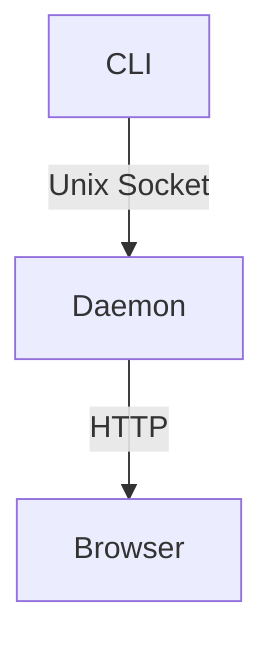

# Getting Started

Welcome to md-view — the fastest way to view a Markdown file in your browser.

## Install

**Option 1: Go install (recommended)**

```bash
go install github.com/go-go-golems/md-view/cmd/md-view@latest
```

**Option 2: Build from source**

```bash
git clone https://github.com/go-go-golems/md-view.git
cd md-view
make build
sudo cp md-view /usr/local/bin/
```

**Verify it works:**

```bash
md-view --help
```

## Your First View

```bash
md-view view ./README.md
```

What happens:

1. md-view checks if the background daemon is running
2. If not, it starts one automatically
3. Your browser opens a new window showing the rendered Markdown
4. The CLI exits — the daemon keeps running in the background

The browser title is `md-view: README.md` — handy for window manager matching.

## Live Reload

Keep the browser open. Edit the file in your editor. Save it.

The page refreshes automatically within a second. No reload button, no manual refresh — just edit and watch.

To disable live reload for a specific file:

```bash
md-view view --no-reload ./README.md
```

## Dark Theme

Click the **🌙 Dark** button in the top-right corner of any rendered page. The entire page switches — including syntax highlighting and Mermaid diagrams. Your preference is saved in localStorage and persists across page loads.

Other ways to activate dark theme:

```bash
# CLI flag
md-view view --dark ./README.md

# URL parameter
http://localhost:42213/render?file=/home/you/README.md&theme=dark
```

## Mermaid Diagrams

Write Mermaid diagrams in fenced code blocks:

````

````

md-view renders them as SVG diagrams automatically. Mermaid.js is embedded in the binary — no network required. Diagrams re-render with the correct theme when you toggle dark mode.

## View Multiple Files

Each `md-view view` opens a new browser window:

```bash
md-view view ./README.md
md-view view ./CHANGELOG.md
md-view view ./docs/api.md
```

All served by the same daemon. No extra processes.

## Choose Your Browser

By default, md-view opens Firefox in a new window (`firefox --new-window`). This works great with i3 and Sway floating windows.

Override it for a single command:

```bash
# Use a different browser
md-view view --browser "google-chrome" ./notes.md

# Use the system default browser
md-view view --browser "xdg-open" ./notes.md

# Don't open a browser at all — just print the URL
md-view view --no-browser ./notes.md
```

## i3 / Sway Setup

All md-view windows have titles starting with `md-view:`. To make them float automatically, add to your i3 config (`~/.config/i3/config`):

```
for_window [title="^md-view:.*"] floating enable
```

Then reload:

```bash
i3-msg reload
```

Now every `md-view view` opens as a floating window. For Sway, use the same rule in `~/.config/sway/config` and `swaymsg reload`.

## Check What's Running

```bash
md-view status
```

Output:

```
md-view daemon: running (PID 23461, port 42213)
  uptime: 3s
```

## Stop the Daemon

```bash
md-view stop
```

The daemon cleans up its PID file, socket, and port file on exit.

## What's Next?

- Read the **[User Guide](user-guide.md)** for all commands, flags, i3/Sway integration, and troubleshooting
- Try viewing a file with YAML frontmatter — md-view parses it into a collapsible table
- Add `for_window [title="^md-view:.*"] floating enable` to your i3/Sway config

## Quick Reference

```
md-view view <FILE>                     # View a file (opens Firefox in a new window)
md-view view --dark FILE                # View with dark theme
md-view view --no-reload FILE           # View without live reload
md-view view --no-browser FILE          # Print URL without opening browser
md-view view --browser "xdg-open" FILE  # Use system default browser
md-view view --port 8080 FILE           # Use a specific port
md-view serve                           # Start server in foreground
md-view status                          # Show daemon status
md-view stop                            # Stop the daemon
```
